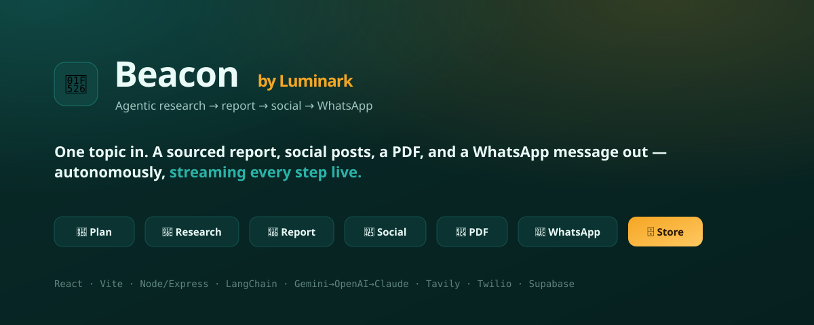

<div align="center">

# 🔦 Beacon

### Give it one topic. It researches the web, writes a sourced report, drafts social posts, generates a PDF, and WhatsApps it to you — autonomously, streaming every step live.

[](https://react.dev)
[](https://vitejs.dev)
[](https://nodejs.org)
[](https://js.langchain.com)
[](https://ai.google.dev)
[](https://supabase.com)
[](https://twilio.com)

**[Live demo →](https://beacon-agent.onrender.com)** &nbsp;·&nbsp; an agentic research console built end-to-end (no n8n, no low-code).

</div>

---



<!-- Tip: replace docs/screenshot.svg above with a real app screenshot (docs/screenshot.png) for extra portfolio polish. -->


## What it does

From a single topic prompt, an autonomous agent pipeline runs seven steps and streams each one to the UI in real time:

1. **🧭 Plans** the research — an LLM decomposes the topic into focused, non-overlapping sub-questions
2. **🔎 Researches** the web — searches, reads real page content (not just snippets), and synthesizes each finding with citations
3. **📝 Writes a report** — a structured, depth-adjustable markdown briefing (5–15 pages)
4. **📣 Drafts social posts** — platform-tailored copy for LinkedIn, X/Twitter, and Instagram
5. **📄 Generates a PDF** — a branded, multi-page report (pure JS, no headless browser)
6. **💬 Sends to WhatsApp** — summary + PDF attachment via Twilio
7. **🗄️ Stores everything** — Supabase, with a recent-runs history you can reopen

The React UI streams every step over **Server-Sent Events**, so you watch the agent think and work rather than staring at a spinner.

## Engineering highlights

- **Agentic orchestration, hand-built** — a custom `plan → research → report → social → pdf → whatsapp → store` pipeline where each node is an LLM-driven step with a clear contract. No n8n or low-code glue.
- **Graceful degradation, everywhere** — runs end-to-end with **zero API keys** in mock mode, then upgrades each capability as you add keys. No key is ever required.
- **Cost-aware LLM fallback chain** — tries **Gemini → OpenAI → Claude** via LangChain's `.withFallbacks()`, failing over on quota/rate-limit/auth errors so a single exhausted free tier never breaks a run.
- **Live streaming UX** — SSE pushes `step:start / step:detail / step:done` events; the frontend renders a real-time agent timeline.
- **Honest status surfacing** — header pills show exactly which providers are live vs. mocked, and a banner flags when output was templated because every LLM hit its daily quota.

## Stack

| Layer            | Implementation                                                  |
| ---------------- | -------------------------------------------------------------- |
| Frontend         | **React + Vite**, Server-Sent Events for live streaming        |
| Backend          | **Node / Express**                                             |
| Orchestration    | **LangChain** + a custom agentic pipeline                      |
| LLM              | **Gemini → OpenAI → Claude** fallback chain                    |
| Research         | **Tavily** → DuckDuckGo → mock                                 |
| PDF              | **pdfkit** (pure JS, branded multi-page output)                |
| Messaging        | **Twilio** WhatsApp API → mock fallback                        |
| Storage          | **Supabase** (Postgres + Storage) → local JSON fallback        |

## Architecture

```
web/ (React + Vite)
  └─ EventSource ──► server/index.js (Express, SSE)
                        └─ agent/pipeline.js  ── plan→research→report→social→pdf→whatsapp→store
                              ├─ agent/llm.js            (Gemini→OpenAI→Claude fallback)
                              ├─ integrations/search.js  (Tavily→DuckDuckGo→mock)
                              ├─ integrations/pdf.js     (pdfkit → Supabase Storage)
                              ├─ integrations/whatsapp.js (Twilio→mock)
                              └─ integrations/store.js   (Supabase→local JSON)
```

## Quick start

```bash
cd beacon-agent
npm install
cp .env.example .env     # Windows: copy .env.example .env — fill in any keys you have
npm run dev              # server on :8787, web on :5173
```

Open **http://localhost:5173**. With **zero keys** it still runs end-to-end in mock mode — add keys incrementally and the header pills show what's live.

### Getting keys (all optional)

- **Gemini (free):** https://aistudio.google.com/apikey → `GOOGLE_API_KEY`
- **Tavily (free search):** https://tavily.com → `TAVILY_API_KEY`
- **Twilio WhatsApp sandbox:** Twilio Console → Messaging → Try it out → join the sandbox from your phone, then set `TWILIO_ACCOUNT_SID`, `TWILIO_AUTH_TOKEN`, `TWILIO_WHATSAPP_TO` (`whatsapp:+91…`).
- **Supabase:** create a project, run `server/db/schema.sql` in the SQL editor, then set `SUPABASE_URL` + `SUPABASE_SERVICE_KEY`.

## Deployment

Deployed as a single long-running Node service on **[Render](https://render.com)** (the Express server serves both the API and the built frontend). The repo ships a [`render.yaml`](render.yaml) Blueprint:

1. Push to GitHub → Render **New → Blueprint** → select this repo
2. Render reads `render.yaml` and prompts for the secret env vars
3. Build: `npm install --include=dev && npm run build` · Start: `npm start`

> Why Render and not Vercel? The agent holds an open SSE stream for 20–90s per run — longer than serverless function limits — and serves generated PDFs. A persistent container fits the architecture; PDFs are also uploaded to Supabase Storage so download links survive restarts.

## Production build (local)

```bash
npm run build     # bundles React into dist/
npm start         # Express serves API + static frontend on :8787
```

## API

| Method | Route                                   | Description                          |
| ------ | --------------------------------------- | ------------------------------------ |
| `GET`  | `/api/status`                           | Which providers / modes are live     |
| `GET`  | `/api/run?topic=…&brand=…&depth=…`      | **SSE** stream of agent steps        |
| `POST` | `/api/run`                              | `{ topic, brand, … }` → full JSON    |
| `GET`  | `/api/runs`                             | Recent stored runs                   |
| `GET`  | `/api/pdf/:id`                          | Download a generated PDF             |

---

<div align="center">
<sub>Built as an Advanced Challenge PoC — an autonomous research-to-WhatsApp agent, from scratch.</sub>
</div>
